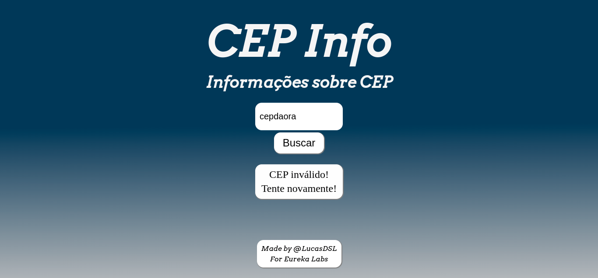
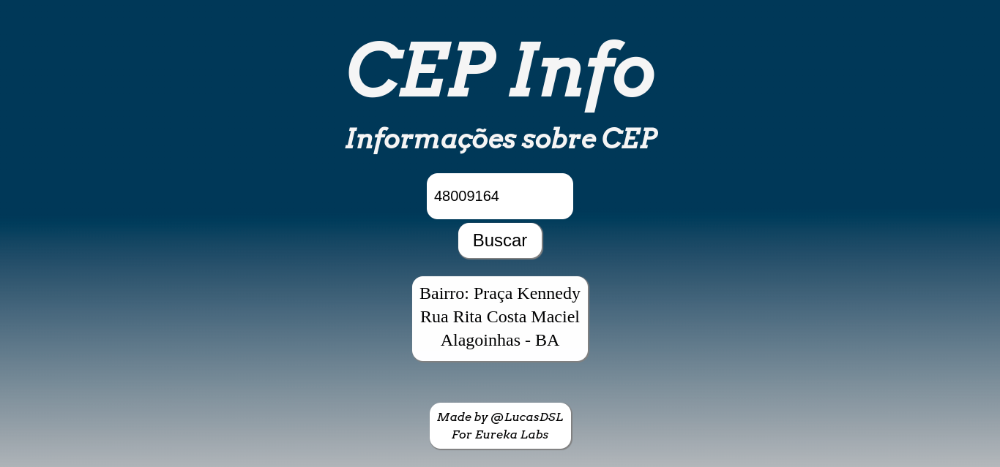
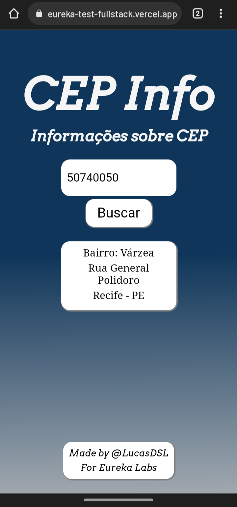
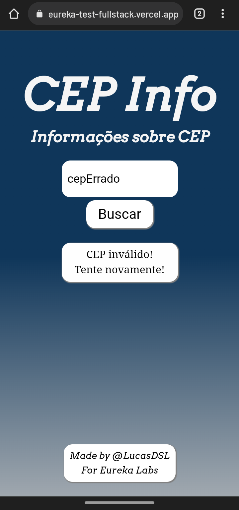

# Eureka Labs' Tech Test 

I followed this [planning](https://scientific-iridium-246.notion.site/Planning-for-Eureka-s-tech-test-99fe7b24d3a345a1a3bd4f370d7613b2) to make this project real.

## 🛠 &nbsp;Tech Stack
Backend: &nbsp;
&nbsp;
&nbsp;
&nbsp;
&nbsp;

Frontend: &nbsp;
&nbsp;&nbsp;&nbsp;

## Run it locally
- Clone the repository and go to the folder: 
```terminal
git clone https://github.com/LucasDSL/eureka-test-fullstack.git repo_clone
cd repo_clone
```  
### Backend

- Go to the backend folder and install dependencies:  
```terminal
cd backend
npm install 
``` 
- Create the .env file and fill it accordly to the .env.example folder:
```env
DATABASE='database_name'
CONN_HOST=localhost
PASSWORD=<your_password>
DB_USER=<your_user>
PORT=<api_port>
```
- Now run it: 
```terminal 
npm start
```
You can make requests accordly to the [API documentation](https://documenter.getpostman.com/view/16085223/UVyxRts6)

### Frontend 
- Go to the frontend folder and install dependencies:  
```terminal
cd frontend
npm install 
``` 
- In the backend.js file you have the option of changing the link of the backend, so you may use the local backend.
- Now run it: 
```terminal 
npm start
```

### Tests
There may be a small change on design, but funcionalities stays the same!

On the website, when asking for invalid ceps: 
<div>


</div>

When asking for valid ceps:

Obs: First request after a while may take some time on the vercel webpage because the heroku api might be asleep, but it awakes almost quickly!
<div>


</div>

On mobile(MOTO G 10), both kind of request:
<div >


</div> 